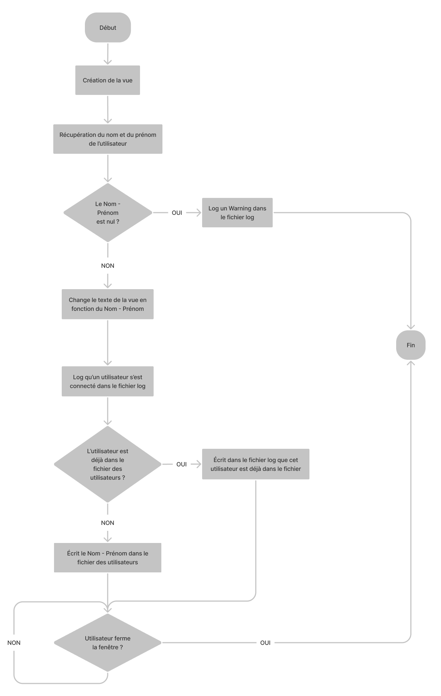

# UserRetrieval
UserRetrieval is a small app runnun at windows startup that logs the users Name and Surname on a global log file.

### Task list
- [x] Retreive Name and Surname
- [x] Display Name and Surname
- [ ] Auto launch at windows startup -> To do during deployment
- [x] Add Name and Surname on txt log
#### Optional
- [ ] Fullscreen app

### ToDo before production
- [x] Edit font of the main view, it's kinda ugly rn
- [ ] Test on multiple computers with different usernames and logins

## Setup and guide
First, clone this repo.
### Change log path
In the [Program.cs](./src/UserRetrieval/UserRetrieval/Program.cs) file, you can edit the AppLogPath and UserLogPath at line **24** and **25**. They are eather relative from where the executable is (./...), or absolute (C:/...).
Compile the program and run it. Its also accessible in the [Debug](./src/UserRetrieval/UserRetrieval/bin/Debug) or [Release](./src/UserRetrieval/UserRetrieval/bin/Release) folder, depending on the compiling method you used.

## Diagrams
### Sequence
